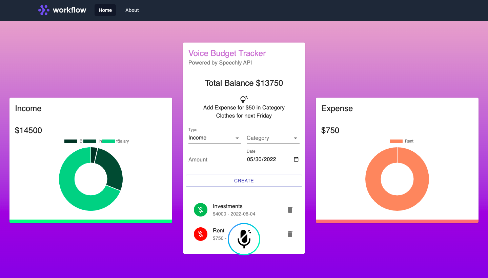

# Voice Budget Tracker

A voice enabled web app to track and visualize income and expenses. Transactions are displayed in doughnut and pie charts.

## Tools/ Technologies used

1. Charts and visualizations: [Chart.js](https://www.chartjs.org/)

2. Illustrations: [Undraw.co](https://undraw.co/illustrations)

3. Components and Design system: [Material UI](https://v4.mui.com/)

4. Gradient Background: [Web Gradients](https://webgradients.com/)

5. State Management: Context API

6. Voice API: [Speechly](https://www.speechly.com/)

7. Nav Menu: [TailwindCSS](https://tailwindui.com/)

## Instructions to Run

In the project directory, you can run:

### `npm start`

Runs the app in the development mode.\
Open [http://localhost:3000](http://localhost:3000) to view it in your browser.

The page will reload when you make changes.\
You may also see any lint errors in the console.
### `npm run build`

Builds the app for production to the `build` folder.\
It correctly bundles React in production mode and optimizes the build for the best performance.

The build is minified and the filenames include the hashes.\
Your app is ready to be deployed!

See the section about [deployment](https://facebook.github.io/create-react-app/docs/deployment) for more information.
