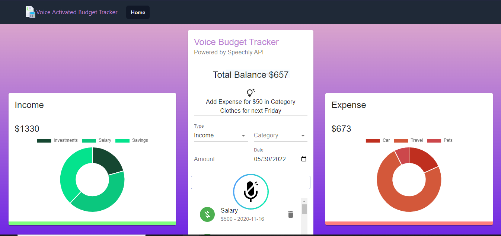

# Voice Budget Tracker

A voice enabled web app to track and visualize income and expenses. Transactions are displayed in doughnut and pie charts.

## Tools/ Technologies used

1. Charts and visualizations: [Chart.js](https://www.chartjs.org/)

2. Nav Menu: [TailwindCSS](https://tailwindui.com/)

3. Components and Design system: [Material UI](https://v4.mui.com/)

4. Voice API: [Speechly](https://www.speechly.com/)

5. State Management: Context API

6. Gradient Background: [Web Gradients](https://webgradients.com/)

7. Illustrations: [Undraw.co](https://undraw.co/illustrations)
## Instructions to Run

- In the project directory, you can run:

### `npm start`

- Runs the app in the development mode.\
Open [http://localhost:3000](http://localhost:3000) to view it in your browser.

- The page will reload when you make changes.\
You may also see any lint errors in the console.

## Future work

1. add monthly charts for Income and Expenses

2. connect to Firestore and implement authentication

3. add delete/ remove to Speechly intents
